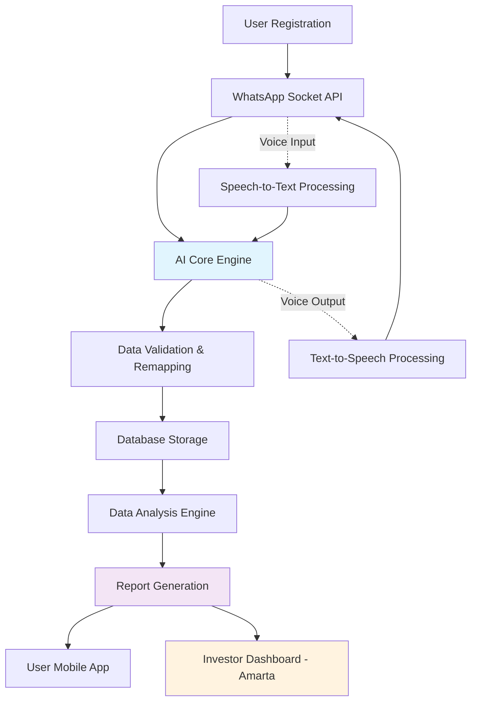
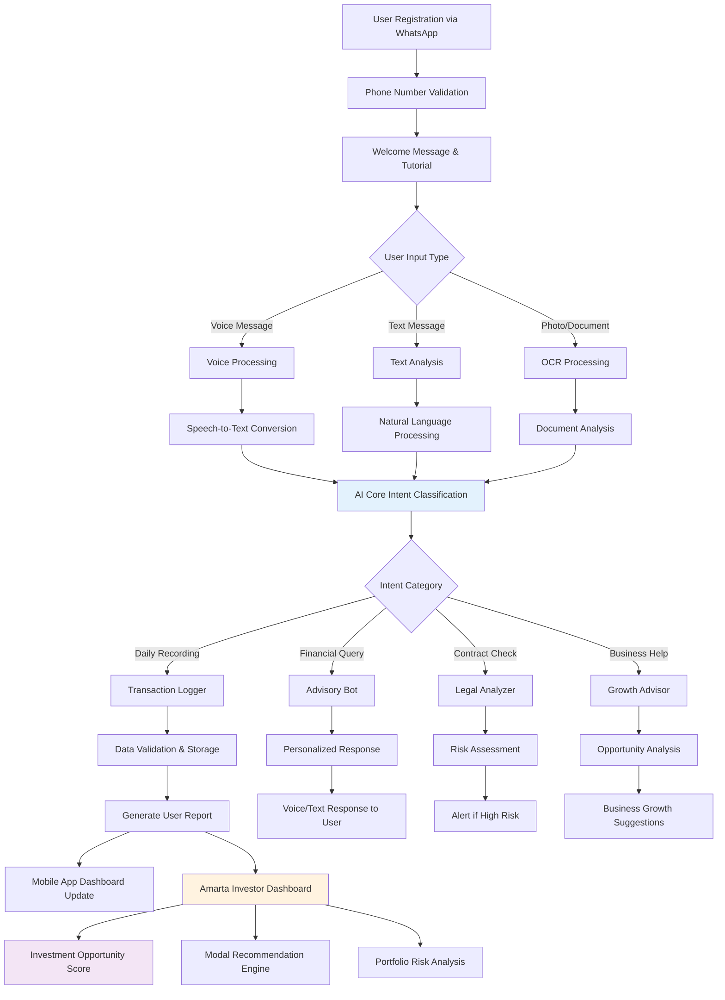

**Team Name:** FinLit Solutions

**Project Title:** FinLit AI Assistant - Platform Literasi Keuangan Berbasis AI untuk UMKM Pedesaan

***Important Note:** This proposal document must not exceed 3 pages or 1000 words.*

---

## **1. Problem Statement**
**(Approximately 200-250 words)**

### **Masalah Utama: Rendahnya Literasi Keuangan di Pedesaan**

Di wilayah pedesaan Indonesia, terdapat permasalahan serius terkait rendahnya tingkat literasi, khususnya literasi keuangan. Meskipun sebagian masyarakat mampu membaca, namun kurangnya pemahaman kontekstual terhadap informasi tertulis menyebabkan kesulitan dalam menyelesaikan masalah administratif dan keuangan sehari-hari.

**Dampak Spesifik pada Ibu-Ibu Pedesaan:**
Kelompok yang paling terdampak adalah ibu-ibu rumah tangga yang seringkali berperan sebagai pengelola keuangan keluarga dan pelaku usaha kecil. Mereka menghadapi kendala dalam:
- Pengelolaan aset dan dokumentasi keuangan yang tidak terstruktur
- Ketidakmampuan melakukan pencatatan keuangan yang baik
- Rentan terhadap praktik pinjaman ilegal dari rentenir/lintah darat
- Kurangnya optimalisasi dalam mengelola kebiasaan finansial harian

**Kasus Nyata dan Urgensi:**
Banyak ibu-ibu pemilik usaha kecil yang tidak dapat membaca laporan keuangan atau kontrak pinjaman, sehingga terjebak dalam skema pinjaman berbunga tinggi. Hal ini mengakibatkan bisnis yang semula berkembang menjadi terlilit hutang dan akhirnya gulung tikar. Masalah ini semakin mendesak karena akses teknologi digital meningkat, namun tidak diimbangi dengan literasi yang memadai.

**Signifikansi Masalah:**
Menurut Survei Nasional Literasi dan Inklusi Keuangan (SNLIK) OJK 2022, tingkat literasi keuangan masyarakat Indonesia mencapai 49,68%, namun di wilayah pedesaan angka ini jauh lebih rendah¹. Data BPS 2023 menunjukkan bahwa 60% UMKM di pedesaan mengalami kesulitan pengelolaan keuangan, dengan 25% di antaranya terpaksa tutup dalam 2 tahun pertama operasi². Kondisi ini mempengaruhi sekitar 15 juta keluarga di Indonesia, dengan kerugian ekonomi diperkirakan mencapai Rp 50 triliun per tahun akibat kesalahan pengelolaan keuangan dan terjebak praktik rentenir³.

---

## **2. Proposed Solution/Concept**
**(Approximately 250-300 words)**

### **FinLit AI Assistant: Platform AI Berbasis Messaging untuk Literasi Keuangan Pedesaan**

Kami mengusulkan pengembangan **"FinLit AI Assistant"** - platform kecerdasan buatan yang terintegrasi dengan WhatsApp dan Telegram untuk meningkatkan literasi keuangan masyarakat pedesaan, khususnya ibu-ibu pelaku UMKM.

### **Fitur Utama:**

**AI Chatbot Multilingual:** Sistem cerdas yang berkomunikasi dalam bahasa lokal, mengkategorikan masalah keuangan secara otomatis, memberikan panduan pencatatan keuangan sederhana, dan mendeteksi praktik pinjaman ilegal dengan memberikan peringatan dini.

**Integrasi Messaging Platform:** Akses melalui WhatsApp dan Telegram yang familiar, interface sederhana tanpa instalasi aplikasi tambahan, dukungan voice message untuk pengguna dengan keterbatasan baca-tulis, dan notifikasi pengingat otomatis.

**Monitoring & Analytics Dashboard:** Dashboard untuk pemodal memantau perkembangan nasabah, laporan berkala otomatis, risk assessment berbasis pola komunikasi, dan rekomendasi produk keuangan yang sesuai profil.

### **Keunggulan Inovatif:**

**Aksesibilitas Maksimal:** Memanfaatkan platform messaging yang sudah digunakan sehari-hari, menghilangkan barrier teknologi dan learning curve yang tinggi.

**Personalisasi Kontekstual:** AI dirancang khusus memahami budaya dan ekonomi pedesaan Indonesia dengan kemampuan pembelajaran adaptif sesuai kebutuhan lokal.

**Preventive & Predictive:** Tidak hanya reaktif mengatasi masalah, tetapi proaktif mencegah jebakan pinjaman ilegal melalui early warning system dan edukasi berkelanjutan.

**Ecosystem Integration:** Menghubungkan pelaku UMKM dengan lembaga keuangan formal melalui data-driven insights yang saling menguntungkan, menciptakan inklusi keuangan yang sustainable.

Platform ini menjawab urgensi masalah pinjaman ilegal yang meningkat dengan menyediakan alternatif edukasi yang mudah diakses. Dibandingkan solusi existing yang memerlukan instalasi aplikasi khusus dan menggunakan bahasa formal, FinLit AI Assistant memanfaatkan platform familiar dengan dukungan multi-bahasa dan voice interaction, menjadikannya truly accessible untuk target pengguna di pedesaan.

---

## **3. Target Users**
**(Approximately 100-150 words)**

### **Primary Users: Pelaku UMKM Pedesaan dengan Literasi Keuangan Terbatas**

**Ibu Miarti (42 tahun)** - Pedagang warung sayur yang menggunakan modal Rp 300.000 harian tanpa pencatatan sistematis. Keuntungan dihitung dari sisa modal, tanpa optimalisasi belanja. Membutuhkan panduan pencatatan sederhana dan saran modal tambahan untuk mengembangkan bisnis.

**Bapak Ilham (38 tahun)** - Pemilik toko beras yang sering didatangi rentenir. Kesulitan memahami kontrak pinjaman membuatnya rentan kerugian finansial. Memerlukan analisis kontrak yang mudah dipahami untuk menghindari jebakan pinjaman ilegal.

**Demographics:** Usia 35-50 tahun, berlokasi di pedesaan, pengguna aktif WhatsApp/Telegram, mengandalkan komunikasi verbal, dan kesulitan dengan dokumen formal.

**Impact:** Platform akan meningkatkan kemampuan pengelolaan keuangan, memberikan panduan praktis, dan melindungi dari praktik pinjaman merugikan, sehingga bisnis dapat berkembang sustainable dengan akses ke saran modal yang tepat.

---

## **4. High-Level Implementation Strategy**
**(Approximately 200-250 words)**

### **Technical Architecture Overview**

**Core Technology Stack:**
- **Mobile App:** Android Native (Kotlin) untuk dashboard monitoring
- **Messaging Integration:** WhatsApp Business API dengan Socket-based communication
- **AI/ML Engine:** Python dengan TensorFlow/PyTorch untuk NLP dan voice processing
- **Backend:** Node.js/Express dengan RESTful API architecture
- **Database:** MongoDB untuk data fleksibel + PostgreSQL untuk transactional data
- **Cloud Infrastructure:** Google Cloud Platform untuk scalability dan AI services

### **System Architecture Flow**

### **Implementation Workflow**

**User Journey Flow:**

Workflow ini menunjukkan bagaimana setiap input pengguna diproses melalui AI Core untuk menghasilkan tiga output utama: laporan pengguna real-time, analisis peluang bisnis untuk Amarta, dan rekomendasi modal berbasis data behavioral patterns pengguna.

### **Hackathon Development Steps**

**Phase 1 (Day 1-2):** Develop socket-based WhatsApp API integration with basic message handling and user registration system.

**Phase 2 (Day 3-4):** Build AI core engine supporting data validation, remapping, and voice-to-text/text-to-voice processing for illiterate users.

**Phase 3 (Day 5-6):** Create user interface delivery system and implement automated report generation for both users and investors (Amarta platform).

**MVP Deliverables:** Functional WhatsApp bot with voice support, basic AI categorization, simple mobile dashboard, and investor monitoring panel demonstrating end-to-end financial literacy assistance workflow.

---

## **5. Team Members & Roles**
**(Approximately 100-150 words)**

List each team member, their brief background (e.g., IT Student, Developer, UI/UX Designer), and their primary role in this project.

* **[Member Name 1]** - **[Role in Team]**
  * Primary responsibilities: [Example: Responsible for backend development and database management.]
* **[Member Name 2]** - **[Role in Team]**
  * Primary responsibilities: [Example: Designing the user interface (UI/UX) and developing the mobile app frontend.]
* **[Member Name 3]** - **[Role in Team]**
  * Primary responsibilities: [Example: Developing the Machine Learning model and conducting user research.]
* **[Member Name 4]** - **[Role in Team]**
  * Primary responsibilities: [Example: Project management, preparing the presentation, and business strategy.]
* **[Member Name 5]** - **[Role in Team]**
  * Primary responsibilities: [Example: Setting up the Cloud infrastructure and deployment.]

---

### **Referensi:**

¹ **OJK (Otoritas Jasa Keuangan).** 2022. *Survei Nasional Literasi dan Inklusi Keuangan (SNLIK) 2022*.

² **Badan Pusat Statistik (BPS).** 2023. *Statistik Usaha Mikro, Kecil, dan Menengah*.

³ **Bank Indonesia.** 2023. *Laporan Perekonomian Indonesia 2023*.
